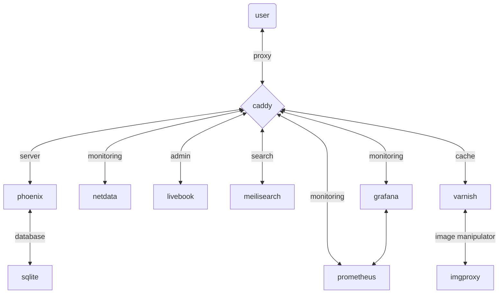

## Hey there!
Thanks for checking out my git profile.

I am a software engineer from India.

- 🔭 I’m currently working on [DerpyTools](https://github.com/derpycoder/derpy_tools)
- 🌱 All the while learning Elixir, Phoenix & Live View
- 👯 Willing to collaborate on Elixir & Phoenix projects
- 💬 Ask me about Elixir & Phoenix
- 📫 How to reach me: abhijit@derpytools.com

### [DerpyTools](https://github.com/derpycoder/derpy_tools)

#### Architecture

### My Tech Stack

##### My Favorite Stack

##### Professional Experience

##### Prior Experience

##### Miscellaneous

### My Community Contributions

1. [Made a Source Code Inspector](https://elixirforum.com/t/made-a-source-code-inspector-useful-in-big-projects-or-large-teams/56792?u=derpycoder)
   
   
3. [Made a Table of Contents using Floki](https://elixirforum.com/t/i-created-table-of-contents-using-floki-with-header-nesting-how-to-simplify-the-logic/57501/12?u=derpycoder)
   
   
5. [Role-based Authentication using FunWithFlags](https://elixirforum.com/t/phx-gen-auth-and-role-based-authentication/49428/8?u=derpycoder)
